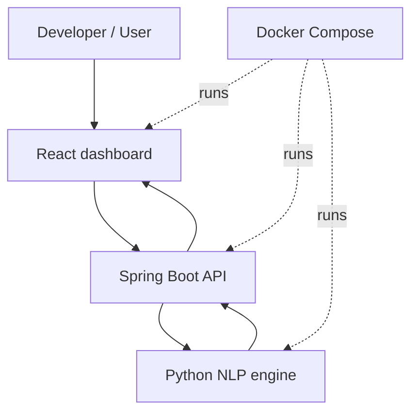
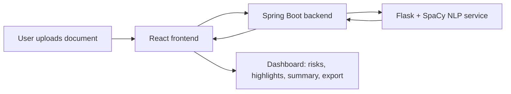

# AI Legal Document Analyser

AI Legal Document Analyser is a three-service legal review platform that turns dense contracts, NDAs, service agreements, and other documents into a structured, easy-to-scan report.

It is designed for the common first-pass review problem:

- legal documents are long and difficult to read quickly
- important obligations are buried in dense prose
- users need a fast way to spot risks, deadlines, money terms, and termination language
- non-lawyers need a simpler explanation without losing the legal detail

This project solves that by combining a React dashboard, a Spring Boot document-ingestion layer, and a Python NLP service that produces structured contract intelligence.

## Developer

- **Name:** Kunal Meena
- **GitHub:** Kunal88591

## What The Product Does

- Uploads `PDF`, `DOCX`, and `TXT` files
- Extracts text from documents in the Java backend
- Analyzes the content with a Python NLP service
- Detects risky clauses, important dates, money values, and durations
- Produces a 5-line summary, clause tags, highlights, a risk score, and a timeline
- Supports jurisdiction-aware analysis, quick questions, search, text-to-speech, and PDF export
- Presents the results in a dashboard that is easier to review than the raw file

## Problem Statement

Legal documents are usually written for precision, not readability.

That creates three practical problems:

1. Review time is high because the reader must inspect the full document manually.
2. Risky language is easy to miss because it is spread across many clauses.
3. Non-specialists often need a simpler explanation before they can decide what to do.

This application aims to reduce the first-pass review burden by extracting the structure that matters most:

- what kind of contract it is
- which clauses look risky
- what dates and deadlines matter
- how severe the overall risk appears
- what the document means in plain language

## Solution Overview

The system uses a layered approach:

1. **Frontend presentation layer**
   - Handles upload, drag and drop, filtering, search, summary display, speech playback, and PDF export.

2. **Backend document layer**
   - Accepts uploaded files, extracts plain text from PDFs and Word documents, and forwards normalized text to the NLP layer.

3. **NLP intelligence layer**
   - Performs rule-based and SpaCy-assisted analysis to detect clauses, extract facts, score risk, and generate structured JSON.

This separation keeps the UI responsive, keeps file parsing away from the browser, and makes the analysis engine easy to evolve.

## Architecture

### At A Glance



### High-Level Flow



### Service Responsibilities

#### React Frontend

The frontend is the user-facing analysis workspace.

It provides:

- drag and drop upload
- jurisdiction selection
- private mode toggle
- plain-language summary view
- clause tags and highlight cards
- risk meter and clause distribution
- search inside the analyzed text
- quick questions
- text-to-speech reading
- PDF report export

Primary UI files:

- [frontend-react/src/DocumentUpload.js](frontend-react/src/DocumentUpload.js)
- [frontend-react/src/DocumentUpload.css](frontend-react/src/DocumentUpload.css)
- [frontend-react/src/App.js](frontend-react/src/App.js)

#### Spring Boot Backend

The backend is the document-processing gateway.

Its responsibilities are:

- accept multipart file uploads
- detect file type
- extract text from PDF, DOCX, or TXT files
- forward the text to the NLP service
- forward simplify requests to the NLP service
- return structured responses and readable errors to the frontend

Primary backend file:

- [backend-java/src/main/java/com/legalanalyzer/controller/DocumentController.java](backend-java/src/main/java/com/legalanalyzer/controller/DocumentController.java)

#### Python NLP Service

The NLP service turns raw text into contract intelligence.

It currently performs:

- clause detection
- risk categorization
- fact extraction for dates, money, and durations
- summary generation
- document simplification
- question-answer style responses

Primary NLP file:

- [python-ml-services/nlp-service/app.py](python-ml-services/nlp-service/app.py)

## Data Flow

1. The user uploads a file in the React app.
2. The frontend sends the file and jurisdiction to `POST /api/documents/upload`.
3. The backend reads the file and extracts text.
4. The backend sends text to the NLP service `POST /analyze`.
5. The NLP service returns structured JSON.
6. The backend returns that JSON to the frontend.
7. The frontend renders the results in a dashboard with summaries, risk scoring, highlights, and export tools.

## Analysis Output

The response is intentionally structured so the UI can render multiple views of the same document.

Typical fields include:

- `summary`
- `simpleSummary`
- `summaryPoints`
- `riskScore`
- `riskLevel`
- `clauseTags`
- `highlights`
- `timeline`
- `qa`
- `facts`
- `cleanOutput`

This makes the result usable for both:

- fast review by a non-technical user
- deeper review by someone who wants the original clauses and extracted facts

## Tech Stack

- **Frontend:** React 19, axios, jsPDF
- **Backend:** Spring Boot 3 WebFlux, PDFBox, Apache POI
- **NLP:** Flask, SpaCy, regex extraction, rule-based clause detection
- **Deployment:** Docker and Docker Compose

## Repository Structure

```text
/
├── docker-compose.yml
├── backend-java/
│   ├── Dockerfile
│   ├── pom.xml
│   └── src/main/
│       ├── java/com/legalanalyzer/
│       └── resources/
├── frontend-react/
│   ├── Dockerfile
│   ├── package.json
│   └── src/
└── python-ml-services/
    └── nlp-service/
        ├── Dockerfile
        ├── requirements.txt
        └── app.py
```

## Local And Docker Run Modes

### Docker Compose

Recommended for the full stack.

```bash
docker compose up --build
```

Then open:

- Frontend: http://localhost:3000
- Backend: http://localhost:8080
- NLP service: http://localhost:5000

### Local Development

Run the services in this order:

1. Python NLP service
2. Spring Boot backend
3. React frontend

If you run outside Docker, make sure the frontend can reach the backend API used by the upload flow.

## API Endpoints

- `POST /api/documents/upload` - upload a document for analysis
- `POST /api/documents/simplify` - simplify a selected text block

## Configuration

Important runtime settings:

- `NLP_SERVICE_URL` - backend URL for the Python NLP service
- frontend API base URL - controls where the UI sends upload requests in local development

## Why The Project Is Split This Way

This architecture keeps each concern isolated:

- the browser stays focused on interaction and presentation
- the backend handles file compatibility and transport
- the NLP service focuses on analysis and structured output

That split also makes it easier to evolve each layer independently:

- change the UI without touching parsing logic
- improve document extraction without retraining NLP logic
- replace the rule-based model later without rewriting the upload flow

## Design Principles

- **Structure first:** users should see tags, risks, and highlights before reading paragraphs.
- **Explainable output:** every summary should still map back to the underlying text.
- **Fast first pass:** the system should help decide what deserves attention.
- **Jurisdiction-aware review:** the same clause can have different risk depending on location.
- **Practical UX:** upload, review, simplify, search, and export should all feel like one workflow.

## Current Capabilities

- contract and clause detection
- risk scoring and risk labels
- 5-line summary cards
- simplified plain-language summary
- important dates timeline
- search within analyzed text
- quick question answers
- PDF report export
- text-to-speech playback
- dark-mode-ready dashboard styling

## Limitations

This is a smart review assistant, not a legal advice system.

It can help a user spot issues faster, but it should not replace a qualified legal review for high-stakes decisions.

## Useful Files

- [frontend-react/src/DocumentUpload.js](frontend-react/src/DocumentUpload.js)
- [frontend-react/src/DocumentUpload.css](frontend-react/src/DocumentUpload.css)
- [backend-java/src/main/java/com/legalanalyzer/controller/DocumentController.java](backend-java/src/main/java/com/legalanalyzer/controller/DocumentController.java)
- [python-ml-services/nlp-service/app.py](python-ml-services/nlp-service/app.py)
- [docker-compose.yml](docker-compose.yml)

## Next Improvements

- save analysis history and document versions
- add comparison between document revisions
- improve clause classification with a stronger model
- support more file types and OCR for scanned documents
- add persistent audit logs for review sessions
