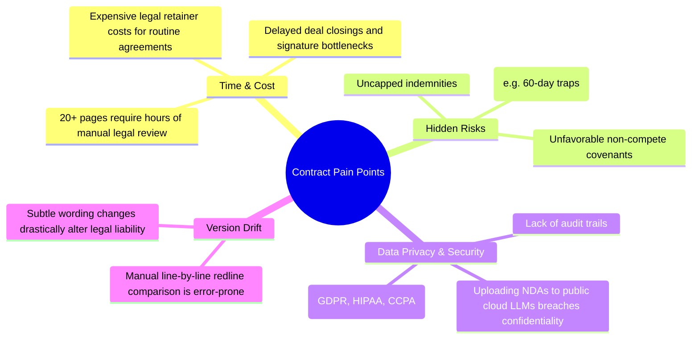
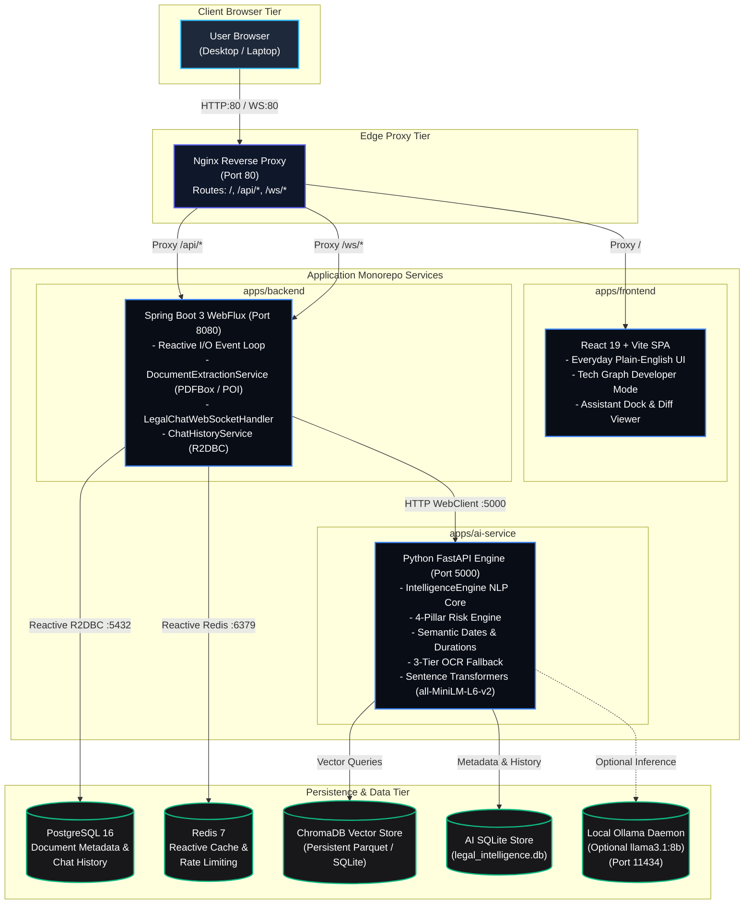
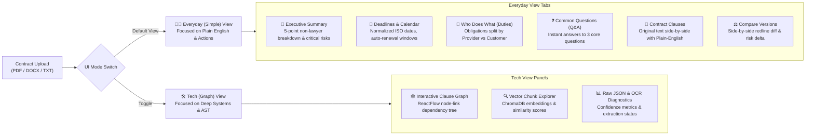
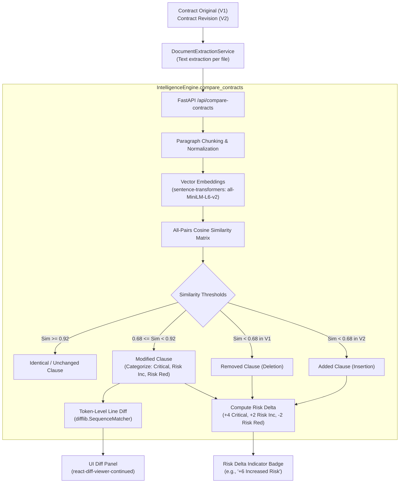
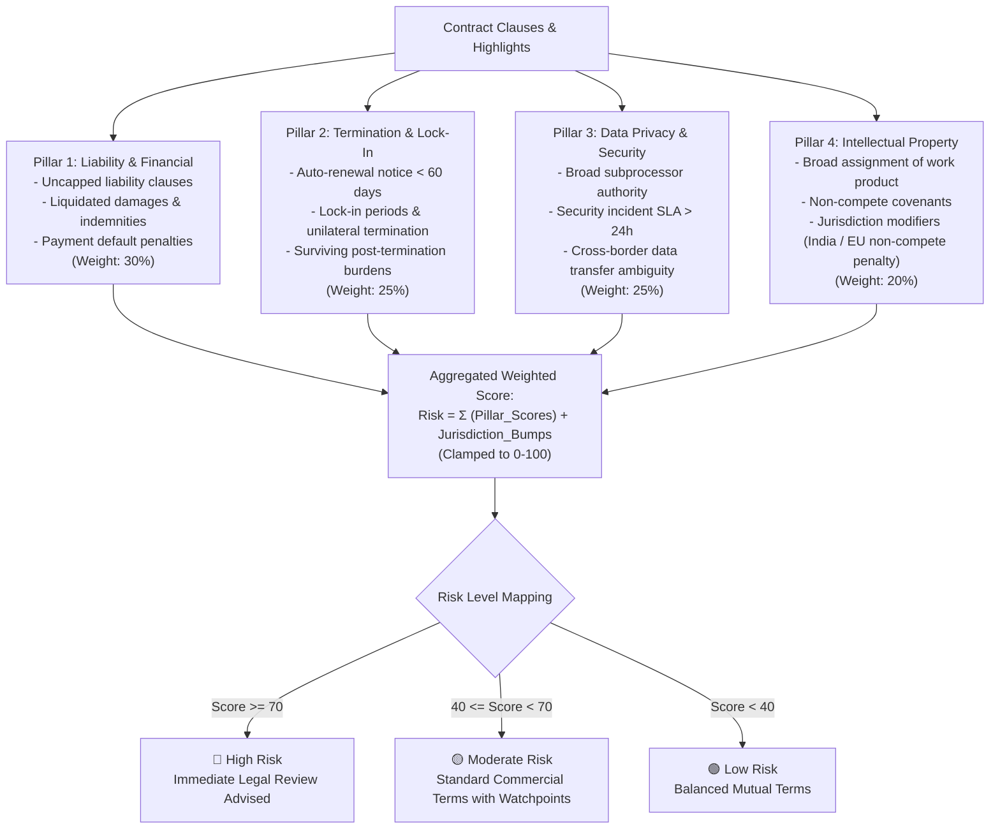
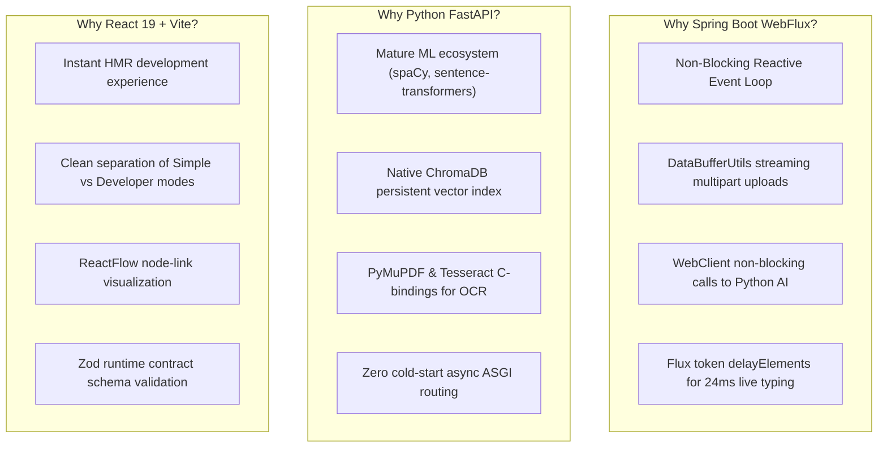
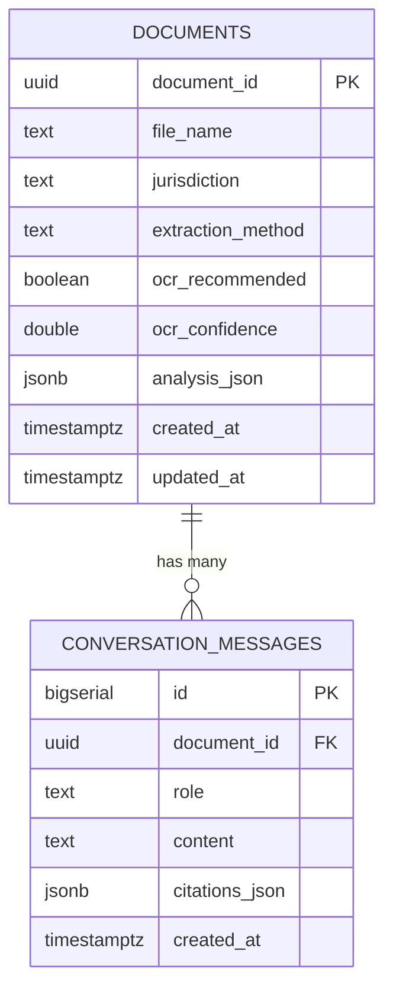
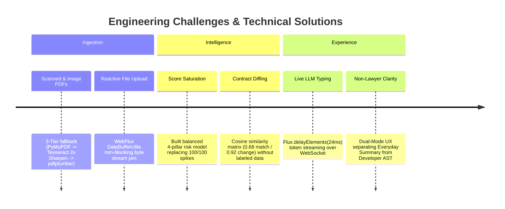

# AI Legal Document Analyser (v2.1 Enterprise Edition)

> **A full-stack, local-first legal intelligence platform** that extracts, simplifies, risk-assesses, and compares complex contracts — operating 100% locally with zero cloud AI API dependencies.

[](#7-repository-structure)
[](#5-tech-stack)
[](#5-tech-stack)
[](#5-tech-stack)
[](#2-problem-statement)

---

## Table of Contents

1. [Project Overview](#1-project-overview)
2. [Problem Statement](#2-problem-statement)
3. [System Architecture & Topology](#3-system-architecture--topology)
4. [Dual-Mode User Experience](#4-dual-mode-user-experience)
5. [Key Capabilities & Feature Matrix](#5-key-capabilities--feature-matrix)
6. [Complete Data Flow & Pipeline Diagrams](#6-complete-data-flow--pipeline-diagrams)
   - [Pipeline 1: Document Ingestion & NLP Intelligence Flow](#pipeline-1-document-ingestion--nlp-intelligence-flow)
   - [Pipeline 2: Reactive Real-Time WebSocket Streaming](#pipeline-2-reactive-real-time-websocket-streaming)
   - [Pipeline 3: Semantic Contract Comparison & Risk Delta](#pipeline-3-semantic-contract-comparison--risk-delta)
   - [Pipeline 4: Multi-Pillar Risk Engine Model](#pipeline-4-multi-pillar-risk-engine-model)
7. [Tech Stack & Engineering Rationale](#7-tech-stack--engineering-rationale)
8. [Repository Directory Structure](#8-repository-directory-structure)
9. [API Reference Specification](#9-api-reference-specification)
10. [Database Schema & Persistence Topology](#10-database-schema--persistence-topology)
11. [Quick Start & Local Execution](#11-quick-start--local-execution)
12. [Sample Documents & Regression Testing](#12-sample-documents--regression-testing)
13. [Environment Configuration](#13-environment-configuration)
14. [Technical Challenges Solved](#14-technical-challenges-solved)
15. [Roadmap & Future Enhancements](#15-roadmap--future-enhancements)
16. [Essential Documentation](#16-essential-documentation)
17. [Legal Disclaimer](#17-legal-disclaimer)

---

## 1. Project Overview

**AI Legal Document Analyser** is an enterprise-grade monorepo delivering privacy-first, on-premise contract intelligence. It automates the parsing, risk scoring, obligation tracking, deadline extraction, and conversational retrieval of complex legal agreements without sending sensitive documents to external proprietary APIs (such as OpenAI or Anthropic).

The platform consists of four coordinated tiers:
1. **Edge Gateway (`Nginx`)**: Unified reverse proxy routing REST, WebSocket, and static assets across port `80`.
2. **Client Dashboard (`React 19 + Vite`)**: A modern interface featuring an **Everyday (Simple)** view for business users and a **Tech (Graph)** mode for legal engineers.
3. **Reactive Gateway Backend (`Spring Boot 3 WebFlux`)**: High-throughput, non-blocking orchestration tier handling reactive document streaming, Apache PDFBox/POI text parsing, R2DBC PostgreSQL storage, and tokenized WebSocket streaming.
4. **Intelligence AI Service (`Python FastAPI`)**: High-performance local NLP service executing multi-clause classification, 4-pillar risk modeling, semantic date/duration normalization, ChromaDB RAG vector search, PyMuPDF + Tesseract OCR fallback, and optional Ollama LLM generation.

---

## 2. Problem Statement

### The Reality of Modern Contracts
Commercial contracts, non-disclosure agreements (NDAs), Master Service Agreements (MSAs), and employment letters are intentionally dense, filled with archaic legalese and critical liabilities buried across hundreds of paragraphs.



### Our Solution
A **100% offline-capable, locally executed legal intelligence suite** that:
- Ingests PDF, DOCX, and TXT files directly in-memory.
- Falls back to a 3-layer computer vision OCR pipeline if scanned pages are detected.
- Evaluates risk across **4 balanced pillars** rather than arbitrary heuristics.
- Extracts calendar-ready deadlines and translates legalese into everyday plain English.
- Compares contract revisions using semantic cosine similarity and tokenized diffing.
- Provides a conversational AI Copilot with precise clause citations.

---

## 3. System Architecture & Topology

The platform operates within an orchestrated Docker Compose network, isolating services while exposing a unified edge port (`80`):



---

## 4. Dual-Mode User Experience

The application is structured with a distinct **Dual-Mode UX Philosophy** to serve both business decision-makers and technical legal engineers:



---

## 5. Key Capabilities & Feature Matrix

| Capability | Everyday (Simple) View | Developer / Legal Tech Mode | Engine Behind It |
|---|---|---|---|
| **Plain-English Summary** | 5-bullet business briefing highlighting primary commercial purpose and red flags | Full chunk summaries with token distributions | NLP regex parser + spaCy heuristics |
| **Risk Assessment** | Overall score (0–100), Level (Low/Moderate/High), and plain rationale | 4-Pillar breakdown: Financial, Termination, Privacy, and IP scores | Weighted heuristic mathematical model |
| **Deadlines & Timing** | Calendar cards for effective date, expiration, and non-renewal windows | Normalized ISO 8601 timestamps with rule triggers | Multi-pattern regex + temporal normalizer |
| **Obligation Tracking** | Distinct columns: Provider duties vs Customer duties with due dates | Structured AST obligation objects with severity tags | Sentence classifier & entity relation extractor |
| **Contract Comparison** | Visual side-by-side word diff with Risk Delta indicator (+4, -2) | Cosine similarity scoring (<0.68 added, <0.92 modified) | `sentence-transformers` + `difflib.SequenceMatcher` |
| **AI Copilot Chat** | Natural language chat with clickable clause citation tags | Streaming WebSocket token viewer with prompt inspection | RAG over ChromaDB + optional Ollama LLM |
| **OCR Fallback** | Automated — transparently extracts scanned and photocopied pages | Displays extraction method (`apache-poi`, `pymupdf`, `tesseract`) & confidence | PyMuPDF + Tesseract 2x sharpened OCR |

---

## 6. Complete Data Flow & Pipeline Diagrams

### Pipeline 1: Document Ingestion & NLP Intelligence Flow

```mermaid
sequenceDiagram
    autonumber
    actor User as User Browser
    participant Nginx as Nginx Proxy (:80)
    participant WebFlux as Spring Boot Backend (:8080)
    participant FastAPI as FastAPI AI Service (:5000)
    participant Chroma as ChromaDB Vector Store
    participant SQLite as Local SQLite DB

    User->>Nginx: POST /api/documents/upload (Multipart File + Jurisdiction)
    Nginx->>WebFlux: Proxy forward to /api/documents/upload
    
    rect rgb(15, 23, 42)
        Note over WebFlux: Reactive Non-Blocking File Read
        WebFlux->>WebFlux: DocumentExtractionService (PDFBox / Apache POI)
        WebFlux->>WebFlux: Check text length (<180 chars triggers OCR recommended)
    end

    WebFlux->>FastAPI: POST /api/analyze-document (Extracted Text + Raw File Bytes)
    
    rect rgb(30, 41, 59)
        Note over FastAPI: IntelligenceEngine Processing
        alt Text is Sparse (< 180 chars)
            FastAPI->>FastAPI: 3-Tier OCR (PyMuPDF -> Tesseract 2x sharpen -> pdfplumber)
        end
        FastAPI->>FastAPI: spaCy Sentence Boundary Detection
        FastAPI->>FastAPI: Regex Fact Extraction (Dates, Durations, Money)
        FastAPI->>FastAPI: 10-Class Legal Clause Keyword Categorization
        FastAPI->>FastAPI: 4-Pillar Risk Engine Scoring (0-100)
        FastAPI->>FastAPI: Plain-English Text Simplification
        FastAPI->>FastAPI: Structured Obligation & Timeline Extraction
    end

    FastAPI->>Chroma: Embed chunks (all-MiniLM-L6-v2) & upsert collection
    FastAPI->>SQLite: Persist document metadata, full text, and analysis snapshot
    FastAPI-->>WebFlux: Return complete Analysis JSON payload
    WebFlux-->>Nginx: Return AnalysisResponse DTO
    Nginx-->>User: Render Dashboard (Executive Summary, Deadlines, Duties)
```



---

### Pipeline 2: Reactive Real-Time WebSocket Streaming

```mermaid
sequenceDiagram
    autonumber
    actor User as User Browser
    participant Nginx as Nginx Proxy (:80)
    participant WSHandler as LegalChatWebSocketHandler
    participant ChatService as ChatHistoryService
    participant FastAPI as FastAPI AI Service (:5000)
    participant Chroma as ChromaDB
    participant Ollama as Local Ollama LLM (:11434)
    participant PG as PostgreSQL (R2DBC)

    User->>Nginx: Connect WebSocket: /ws/copilot
    Nginx->>WSHandler: Upgrade connection (101 Switching Protocols)
    
    User->>WSHandler: Send frame: { documentId, message, history, messageId }
    WSHandler->>ChatService: Process message & orchestrate persistence
    ChatService->>FastAPI: POST /api/copilot/chat
    
    rect rgb(30, 41, 59)
        FastAPI->>Chroma: Vector search query (top-k nearest chunks)
        Chroma-->>FastAPI: Return relevant clause excerpts + line numbers
        alt Ollama Running
            FastAPI->>Ollama: POST /api/chat (System Prompt + RAG Context)
            Ollama-->>FastAPI: Generated legal answer
        else Ollama Offline
            FastAPI->>FastAPI: Grounded keyword fallback synthesis
        end
    end

    FastAPI-->>ChatService: Return { answer, citations: [...] }
    
    rect rgb(15, 23, 42)
        Note over WSHandler: Reactive Token Chunking (24ms Delay)
        loop Each whitespace token
            WSHandler-->>User: WS frame: { type: "chunk", chunk: "word ", citations }
        end
        WSHandler-->>User: WS frame: { type: "done", messageId, citations }
    end

    par Async Durable Persistence
        ChatService->>PG: R2DBC INSERT into conversation_messages
    and Local AI Store
        FastAPI->>FastAPI: SQLite INSERT into conversations
    end
```



---

### Pipeline 3: Semantic Contract Comparison & Risk Delta



---

### Pipeline 4: Multi-Pillar Risk Engine Model

The risk score ($R \in [0, 100]$) is computed through a balanced 4-pillar risk formula rather than arbitrary single-metric penalization:



---

## 7. Tech Stack & Engineering Rationale



| Layer | Component | Version | Rationale & Architectural Purpose |
|---|---|---|---|
| **Gateway** | Nginx | 1.27 Alpine | Single edge port (`80`) preventing CORS issues, handling WebSocket upgrades, and routing `/api/*` to backend and `/` to frontend. |
| **Frontend** | React | 19.x | Component-driven UI supporting rich interactive dashboards, side-by-side diffing, and reactive chat docks. |
| **Build Tool** | Vite | 5.x | Ultra-fast native ESM bundling with hot module reloading. |
| **Styling** | Tailwind CSS + Vanilla CSS | 3.x | Curated modern dark theme with custom glassmorphic styling and responsive layouts. |
| **Graphing** | ReactFlow | 11.x | Interactive node-link clause dependency canvas with zoom and pan. |
| **Diff Viewer** | `react-diff-viewer-continued` | 3.3.1 | Token-level, side-by-side contract revision comparison. |
| **Backend** | Spring Boot | 3.1.2 | Enterprise reactive gateway framework running on Java 17. |
| **Reactive Web** | Spring WebFlux | 3.1.2 | Non-blocking HTTP, multipart streaming, and asynchronous client orchestration. |
| **PDF Extraction** | Apache PDFBox | 3.0.0 | High-fidelity digital text extraction from PDF files in the Java tier. |
| **DOCX Extraction** | Apache POI | 5.2.3 | Native XML parsing of Office OpenXML (`.docx`) contracts. |
| **AI Framework** | FastAPI | 0.115.11 | High-speed ASGI REST microservice for machine learning workloads. |
| **NLP Engine** | spaCy | 3.7.5 | Industrial-strength sentence tokenization and entity recognition (`en_core_web_sm`). |
| **Embeddings** | `sentence-transformers` | 3.0.1 | `all-MiniLM-L6-v2` produces 384-dimensional dense semantic vectors with low CPU footprint. |
| **Vector DB** | ChromaDB | 0.5.5 | Lightweight, persistent vector database utilizing HNSW indexing for cosine similarity search. |
| **OCR Pipeline** | PyMuPDF + Tesseract | 1.24 / 0.3 | 3-tier computer vision pipeline: direct text layer, 2x upscaled sharpened OCR, and `pdfplumber` fallback. |
| **Local LLM** | Ollama (Optional) | external | Zero-cloud LLM inference for grounded contract Q&A (`llama3.1:8b`). |
| **Relational DB**| PostgreSQL | 16 | ACID-compliant storage for document records and conversation histories. |
| **Reactive DB** | R2DBC | 1.0.7 | Fully non-blocking PostgreSQL driver integrated with Spring Data. |
| **Local DB** | SQLite | stdlib | Self-contained persistence within the AI service for autonomous operation. |

---

## 8. Repository Directory Structure

```
.
├── .env.example                               # Canonical environment variables template
├── docker-compose.yml                         # Multi-container orchestration (5 core services)
├── run.bat                                    # One-click Windows runner (starts Ollama + Docker)
├── start-project.ps1                          # PowerShell startup automation script
├── stop.bat                                   # Clean shutdown script
│
├── sample_documents/                          # Pre-loaded sample contracts for instant testing
│   ├── NON-DISCLOSURE AGREEMENT demo.txt      # Standard mutual NDA
│   ├── Legal_AI_Test_Contract_Critical_Clauses.docx  # Multi-clause commercial agreement (DOCX)
│   ├── demo pdf.pdf                           # Sample legal contract in PDF format
│   └── demo2.pdf                              # Secondary PDF revision for diff testing
│
├── tests/                                     # Global system tests & test fixtures
│   └── fixtures/                              # Automated test contract fixtures
│       ├── Legal_AI_Test_Contract_Critical_Clauses.docx
│       └── NON-DISCLOSURE AGREEMENT demo.txt
│
├── apps/
│   ├── ai-service/                            # Python FastAPI AI Microservice (Port 5000)
│   │   ├── Dockerfile                         # Python 3.11 image with Tesseract & spaCy model
│   │   ├── requirements.txt                   # Locked Python dependencies
│   │   ├── app/
│   │   │   ├── main.py                        # FastAPI entrypoint, lifespan handler, CORS
│   │   │   ├── core/config.py                 # Pydantic settings loading from .env
│   │   │   ├── api/routes/legacy.py           # REST endpoints (/analyze, /chat, /compare)
│   │   │   └── services/
│   │   │       └── intelligence_engine.py     # 995-line Core NLP, OCR, RAG, & Risk Engine
│   │   └── tests/                             # Python regression & test suite
│   │       ├── __init__.py
│   │       ├── test_spacy.py                  # spaCy tokenization sanity test
│   │       └── test_intelligence.py           # Full regression test suite (7 assertion suites)
│   │
│   ├── backend/                               # Java Spring Boot 3 WebFlux Backend (Port 8080)
│   │   ├── Dockerfile                         # Multi-stage Eclipse Temurin Java 17 build
│   │   ├── pom.xml                            # Maven dependencies (WebFlux, R2DBC, PDFBox, POI)
│   │   └── src/main/
│   │       ├── java/com/legalai/
│   │       │   ├── LegalAiApplication.java    # Spring Boot entrypoint
│   │       │   ├── modules/documents/         # Document extraction & upload APIs
│   │       │   ├── modules/ai/                # Copilot chat & history orchestration
│   │       │   ├── modules/intelligence/      # Graph & timeline pass-through controllers
│   │       │   └── infrastructure/
│   │       │       ├── ai/NlpGatewayClient.java # WebClient bridge to FastAPI
│   │       │       ├── storage/               # R2DBC PostgreSQL & InMemory stores
│   │       │       └── websocket/             # LegalChatWebSocketHandler streaming
│   │       └── resources/
│   │           ├── application.properties     # Spring configuration
│   │           └── db/migration/V1__init.sql  # Flyway PostgreSQL schema
│   │
│   └── frontend/                              # React 19 + Vite SPA (Port 3000 -> 80)
│       ├── Dockerfile                         # Node build + Nginx static asset server
│       ├── package.json                       # React 19, Tailwind, ReactFlow, jsPDF
│       ├── vite.config.js                     # Vite build configuration
│       └── src/
│           ├── features/dashboard/
│           │   └── Dashboard.jsx              # Main Dashboard (Everyday UI + Developer Toggle)
│           ├── shared/components/
│           │   ├── AssistantDock.jsx          # Real-time WebSocket Copilot chat drawer
│           │   ├── ComparisonPanel.jsx        # Side-by-side redline comparison view
│           │   ├── GraphPanel.jsx             # ReactFlow clause relationship graph
│           │   └── TimelinePanel.jsx          # Chronological deadline & obligation timeline
│           └── shared/services/apiClient.js   # Axios client with Zod schema validation
│
├── packages/
│   └── shared-types/                          # Monorepo contract definitions
│       └── src/index.js                       # Zod validation schemas for all API payloads
│
├── infrastructure/
│   └── nginx/nginx.conf                       # Reverse proxy configuration & upstream definitions
│
├── data/                                      # Local persistent volume mount (gitignored)
│   ├── chroma/                                # ChromaDB vector database files
│   └── legal_intelligence.db                  # AI service SQLite database
│
└── docs/                                      # Deep architectural & developer documentation
    ├── ARCHITECTURE.md                        # Formal system architecture & security topology
    ├── CODEBASE_MAP.md                        # Class-by-class navigation guide
    ├── DEVELOPER_GUIDE.md                     # Engineering runbook & debugging procedures
    ├── INTERVIEW_GUIDE.md                     # Technical pitch & interview Q&A guide
    └── MIGRATION.md                           # Monorepo migration history
```

---

## 9. API Reference Specification

### Backend Gateway Endpoints (Spring Boot — Port 8080)

| Method | Path | Content-Type | Parameters / Body | Description |
|---|---|---|---|---|
| `POST` | `/api/documents/upload` | `multipart/form-data` | `file`: File Part (PDF/DOCX/TXT)<br>`jurisdiction`: String (Optional) | Ingests contract, runs full NLP pipeline, returns complete intelligence object. |
| `POST` | `/api/documents/compare` | `multipart/form-data` | `oldFile`: File Part<br>`newFile`: File Part<br>`jurisdiction`: String | Compares two contract versions using semantic cosine similarity and line diffing. |
| `POST` | `/api/documents/simplify` | `application/json` | `{ "text": "string" }` | Replaces complex legalese with plain English equivalents. |
| `POST` | `/api/copilot/chat` | `application/json` | `{ "documentId": "uuid", "message": "string", "history": [] }` | Synchronous REST chat endpoint with RAG context and citations. |
| `GET` | `/api/copilot/history/{docId}`| — | `docId`: UUID path variable | Retrieves conversational turn history for a document. |
| `WS` | `/ws/copilot` | WebSocket Frame | `{ "documentId": "uuid", "message": "string", "messageId": "string" }` | Real-time token streaming over WebSocket with 24ms typing cadence. |

### AI Microservice Endpoints (FastAPI — Port 5000)

| Method | Path | Description |
|---|---|---|
| `GET` | `/health` | Healthcheck returning `{ "status": "healthy", "service": "nlp-service" }`. |
| `POST` | `/api/analyze-document` | Core NLP entrypoint (chunking, classification, risk, dates, duties). |
| `POST` | `/api/compare-contracts` | Computes semantic similarity matrix, line diffs, and risk deltas. |
| `POST` | `/api/copilot/chat` | Retrieves vector chunks from ChromaDB and prompts Ollama/fallback. |
| `POST` | `/api/copilot/retrieve` | Low-level RAG endpoint returning top-k nearest semantic chunks. |
| `GET` | `/api/intelligence/graph/{id}` | Returns graph AST nodes and edges from SQLite storage. |
| `GET` | `/api/intelligence/timeline/{id}` | Returns timeline events and structured obligations. |

---

## 10. Database Schema & Persistence Topology



### PostgreSQL DDL (`db/migration/V1__init.sql`)
- **`documents` Table**: Stores metadata, extraction method, OCR status, and the complete immutable `analysis_json` snapshot.
- **`conversation_messages` Table**: Stores dialogue turns (`user` vs `assistant`), full response texts, and structured `citations_json` arrays referencing exact clause line numbers.
- **Index**: Composite B-tree index `idx_conversation_document_id_created_at` on `(document_id, created_at)` optimizing chat thread lookups.

### SQLite Store (`data/legal_intelligence.db`)
Maintained autonomously by the Python AI service, ensuring the NLP tier operates independently with `documents`, `conversations`, and `analyses` tables.

---

## 11. Quick Start & Local Execution

### Option 1: One-Click Startup (Recommended for Windows)
The root directory includes automated batch and PowerShell launchers that configure dependencies and start all containers:

```cmd
:: Double-click or run from terminal:
run.bat
```
*`run.bat` checks for Ollama, launches the background daemon if present, verifies Docker Desktop, and executes `docker compose up -d --build`.*

To shut down cleanly:
```cmd
stop.bat
```

---

### Option 2: Docker Compose (Cross-Platform)

```bash
# 1. Clone the repository
git clone https://github.com/Kunal88591/AI-Legal-Document-Analyser.git
cd "AI-Legal-Document-Analyser"

# 2. Copy the environment configuration
cp .env.example .env

# 3. Start all services in the background
docker compose up -d --build

# 4. Access the web dashboard
# Open http://localhost in your browser
```

#### Service URLs
| Service | URL | Direct Port |
|---|---|---|
| **Web Dashboard (Nginx)** | `http://localhost` | Port 80 |
| **Frontend Direct** | `http://localhost:3000` | Port 3000 |
| **Spring Boot Backend** | `http://localhost:8080` | Port 8080 |
| **FastAPI AI Service** | `http://localhost:5000/docs` | Port 5000 |

---

### Option 3: Individual Bare-Metal Development

#### 1. AI Service (Python 3.11)
```bash
cd apps/ai-service
python -m venv .venv
.venv\Scripts\activate       # Windows (.venv/bin/activate on Mac/Linux)
pip install -r requirements.txt
python -m spacy download en_core_web_sm
uvicorn app.main:app --host 0.0.0.0 --port 5000 --reload
```

#### 2. Backend Gateway (Java 17 / Spring Boot)
```bash
cd apps/backend
./mvnw spring-boot:run
```

#### 3. Frontend SPA (Node 18+)
```bash
cd apps/frontend
npm install
npm run dev
```

---

## 12. Sample Documents & Regression Testing

The `sample_documents/` directory provides pre-configured legal agreements designed to test every facet of the platform:

| File | Type | Purpose / What to Look For |
|---|---|---|
| [`sample_documents/NON-DISCLOSURE AGREEMENT demo.txt`](file:///d:/AI%20legal%20document%20analyser/sample_documents/NON-DISCLOSURE%20AGREEMENT%20demo.txt) | Plain Text | Fast upload test. Demonstrates plain-English simplification and mutual confidentiality obligations. |
| [`sample_documents/Legal_AI_Test_Contract_Critical_Clauses.docx`](file:///d:/AI%20legal%20document%20analyser/sample_documents/Legal_AI_Test_Contract_Critical_Clauses.docx) | Word Document | Comprehensive commercial agreement with 13 obligations, auto-renewals, and 4-pillar risk factors. |
| [`sample_documents/demo pdf.pdf`](file:///d:/AI%20legal%20document%20analyser/sample_documents/demo%20pdf.pdf) | Digital PDF | Validates Apache PDFBox digital text extraction and timeline parsing. |
| [`sample_documents/demo2.pdf`](file:///d:/AI%20legal%20document%20analyser/sample_documents/demo2.pdf) | Revision PDF | Use in **Compare Versions** against `demo pdf.pdf` to view side-by-side redline diffing and risk delta. |

### Running the Automated Regression Test Suite
An automated end-to-end regression test validates contract classification, OCR reporting, balanced risk scoring, semantic dates, durations, and obligations:

```bash
# Run inside the active Docker container:
docker exec ailegaldocumentanalyser-nlp-service-1 python /app/ai_tests/test_intelligence.py
```

Expected output:
```text
--- 1. CONTRACT CLASSIFICATION ---
[PASS] Classification accurately identified as Software Services / Commercial Agreement

--- 2. OCR REPORTING ---
[PASS] OCR is properly reported as Not Required for native digital extraction

--- 3. BALANCED RISK SCORING ---
Risk Score: 43/100 (Moderate)
Categories: {'liabilityAndFinancial': 10, 'terminationAndLockIn': 13, 'dataPrivacyAndSecurity': 11, 'intellectualProperty': 9}
[PASS] Risk score is balanced and explainable (not saturated 100)

--- 4. SEMANTIC DATES ---
Detected Semantic Dates: {'EFFECTIVE_DATE': '2026-01-15', 'EXPIRATION_DATE': '2027-01-14', ...}
[PASS] Semantic dates accurately extracted and normalized to ISO 8601

--- 5. SEMANTIC DURATIONS ---
[PASS] All key contractual durations identified and semantically differentiated

--- 6. STRUCTURED OBLIGATIONS ---
Extracted 13 structured obligations: Provider duties vs Customer duties
[PASS] Structured obligations extracted with parties, triggers, and deadlines

--- 7. CONTRACT METADATA ---
[PASS] Core contract metadata extracted accurately
========================================================
   ALL REGRESSION TEST ASSERTIONS PASSED PERFECTLY!     
========================================================
```

---

## 13. Environment Configuration

All microservices read configuration from a unified `.env` file at the repository root:

| Key | Default | Service | Description |
|---|---|---|---|
| `ENVIRONMENT` | `dev` | All | Deployment profile (`dev` or `production`). |
| `NLP_SERVICE_URL` | `http://nlp-service:5000` | Backend | URL of the internal Python AI microservice. |
| `SPRING_R2DBC_URL` | `r2dbc:postgresql://postgres:5432/legalai` | Backend | Reactive R2DBC URL for PostgreSQL persistence. |
| `SPRING_FLYWAY_ENABLED` | `true` | Backend | Enables automatic Flyway database migrations on startup. |
| `SPRING_DATA_REDIS_HOST` | `redis` | Backend | Redis hostname for reactive caching. |
| `LEGAL_DATA_DIR` | `./data` | AI Service | Host-mounted path for ChromaDB and SQLite stores. |
| `OLLAMA_BASE_URL` | `http://host.docker.internal:11434` | AI Service | Base URL for local Ollama daemon. |
| `OLLAMA_MODEL` | `llama3.1:8b` | AI Service | Local LLM model tag for copilot reasoning. |
| `EMBEDDING_MODEL` | `all-MiniLM-L6-v2` | AI Service | Sentence-Transformers model for semantic vectors. |
| `VITE_API_URL` | *(empty string)* | Frontend | Backend API base URL (empty enables reverse proxy routing). |

---

## 14. Technical Challenges Solved



1. **OCR Fallback for Scanned Documents**: Digital text extraction from scanned PDFs returns empty strings. The system implements a three-tier fallback: PyMuPDF text layer $\to$ Tesseract OCR on a 2x upscaled, sharpened grayscale pixmap $\to$ `pdfplumber` recovery.
2. **Reactive Streaming Over WebFlux**: Spring WebFlux lacks `HttpServletRequest`. We used `DataBufferUtils.join()` to collect reactive chunk streams into non-blocking buffers for Apache POI and PDFBox.
3. **Semantic Contract Comparison Without Training Data**: Redline comparison across contracts with altered paragraph order was solved by embedding paragraphs into 384-dimensional dense vectors with `all-MiniLM-L6-v2` and computing an all-pairs cosine similarity matrix.
4. **Real-time Live Typing Over WebSocket**: To prevent blocking threads during LLM generation, responses are ingested reactively, split into whitespace-delimited tokens, and streamed over `/ws/copilot` using `Flux.fromIterable().delayElements(Duration.ofMillis(24))`.

---

## 15. Roadmap & Future Enhancements

- [ ] **Role-Based Access Control (RBAC)**: Implementation of Spring Security 6 with JWT authentication and multi-tenant organization workspaces.
- [ ] **Asynchronous Task Queue**: Migration of heavy OCR and batch vector indexing from synchronous HTTP calls to an asynchronous Celery/Redis worker queue.
- [ ] **Clause Substitution & Redlining Generator**: Generative suggestions for alternate, lower-risk clause phrasing directly within the UI.
- [ ] **TypeScript Type Definitions**: Compilation of `.d.ts` types from the `shared-types` Zod schema definitions.

---

## 16. Essential Documentation

For deeper technical breakdowns, consult the dedicated guides in [`docs/`](file:///d:/AI%20legal%20document%20analyser/docs):

- 📘 [Developer Guide (`docs/DEVELOPER_GUIDE.md`)](file:///d:/AI%20legal%20document%20analyser/docs/DEVELOPER_GUIDE.md) — Comprehensive technical reference: startup lifecycle, architecture, debugging runbooks, and failure modes.
- 🗺️ [Codebase Knowledge Map (`docs/CODEBASE_MAP.md`)](file:///d:/AI%20legal%20document%20analyser/docs/CODEBASE_MAP.md) — Class-by-class navigation map detailing responsibilities, dependencies, and data flows.
- 💼 [Interview Readiness Guide (`docs/INTERVIEW_GUIDE.md`)](file:///d:/AI%20legal%20document%20analyser/docs/INTERVIEW_GUIDE.md) — Technical pitch, verbal architecture walkthrough, and system design Q&A.
- 🏛️ [Architecture Specification (`docs/ARCHITECTURE.md`)](file:///d:/AI%20legal%20document%20analyser/docs/ARCHITECTURE.md) — Real topology, implemented vs planned boundaries, and security controls.

---

## 17. Legal Disclaimer

> **IMPORTANT NOTICE**: This software is an automated computational analysis tool designed for informational, educational, and workflow acceleration purposes only. It **does not constitute legal advice**, nor does it establish an attorney-client relationship. Legal determinations should always be confirmed by licensed legal counsel in the relevant jurisdiction before signing binding agreements.

---

*Built with precision for privacy-first, local-AI legal intelligence.*
