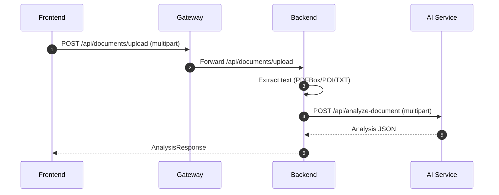
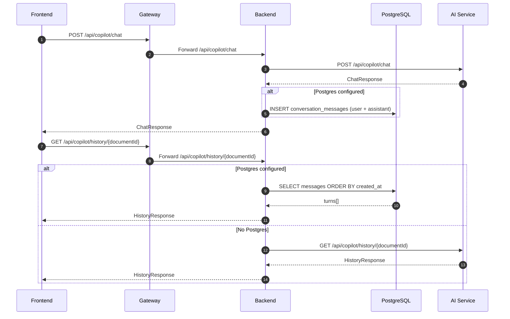

# Legal AI Platform (v2.1)

AI Legal Document Analyser has evolved into a production-ready, local-first **Legal AI Platform** built as a monorepo with a modern edge gateway, a reactive Spring backend, and a FastAPI intelligence service.

It targets first-pass legal review: upload contracts/NDAs, generate structured intelligence, ask Copilot-style questions (REST + WebSocket streaming), and visualize key obligations/dates via graph + timeline.

## What’s New in v2.1

- **Enterprise monorepo layout:** `apps/`, `packages/`, `infrastructure/`, `docs/`
- **Edge gateway (nginx):** production-style routing (`/` → UI, `/api/*` + `/ws/*` → backend)
- **Frontend upgraded:** React 19 + Vite + feature-driven structure
- **AI runtime upgraded:** Flask → **FastAPI** (compatibility endpoints preserved)
- **Persistence added:** **PostgreSQL (R2DBC + Flyway)** + **Redis** in Docker Compose
- **Chat history persistence:** Copilot chat/history stored in Postgres when configured, with safe fallback
- **Shared API contracts:** `packages/shared-types` (Zod schemas) used by the frontend API client
- **Operational hardening:** request correlation via `X-Request-Id`, health endpoints, health-checked compose startup
- **Docker reliability fixes:** frontend Docker build supports monorepo deps; AI service uses **CPU-only PyTorch** wheels to avoid CUDA bloat

## Quickstart (Docker)

Start the full stack:

```bash
docker compose up -d --build
```

Open:

- **Gateway (recommended):** http://localhost
- **Frontend (direct):** http://localhost:3000
- **Backend (direct):** http://localhost:8080
- **AI service (direct):** http://localhost:5000

Health:

- Backend actuator health: `GET http://localhost:8080/actuator/health`

Stop:

```bash
docker compose down
```

## Architecture

### Runtime Topology

```mermaid
flowchart TB
   U[User / Browser]

   subgraph Edge
      G[nginx gateway]
   end

   subgraph Apps
      F[Frontend: React + Vite]
      B[Backend: Spring Boot 3 WebFlux]
      A[AI Service: FastAPI]
   end

   subgraph Data
      P[(PostgreSQL)]
      R[(Redis)]
   end

   U -->|HTTP :80| G
   G -->|/| F
   G -->|/api/*| B
   G -->|/ws/*| B

   B -->|REST (compat endpoints)| A
   B -->|R2DBC| P
   B -->|Redis reactive| R
```

### Core Request Flows

#### 1) Document Upload → Analysis



#### 2) Copilot Chat (REST) + Postgres-backed History (when configured)



#### 3) Copilot Streaming (WebSocket)


### Intelligence Views (Graph + Timeline)

```mermaid
flowchart LR
   UI[Frontend] -->|GET /api/intelligence/graph/{id}| BE[Backend]
   BE -->|GET /api/intelligence/graph/{id}| AI[AI Service]
   AI --> BE
   BE --> UI

   UI -->|GET /api/intelligence/timeline/{id}| BE
   BE -->|GET /api/intelligence/timeline/{id}| AI
```

## Repository Structure

```text
.
├── docker-compose.yml
├── .env.example
├── apps/
│   ├── backend/        # Spring Boot 3 WebFlux API + websocket
│   ├── frontend/       # React 19 + Vite UI
│   └── ai-service/     # FastAPI intelligence service
├── packages/
│   └── shared-types/   # Zod schemas shared with the frontend
├── infrastructure/
│   └── nginx/          # Reverse proxy routing (/ /api /ws)
└── docs/
      ├── ARCHITECTURE.md
      └── MIGRATION.md
```

## Key Code Entry Points

Frontend:

- `apps/frontend/src/main.jsx`
- `apps/frontend/src/app/router/router.jsx`
- `apps/frontend/src/features/dashboard/Dashboard.jsx`
- `apps/frontend/src/shared/services/apiClient.js`

Backend:

- `apps/backend/src/main/java/com/legalai/LegalAiApplication.java`
- `apps/backend/src/main/java/com/legalai/modules/documents/api/DocumentController.java`
- `apps/backend/src/main/java/com/legalai/modules/ai/api/CopilotController.java`
- `apps/backend/src/main/java/com/legalai/infrastructure/websocket/WebSocketConfig.java`

AI service:

- `apps/ai-service/app/main.py`
- `apps/ai-service/app/api/routes/legacy.py` (compat routes)
- `apps/ai-service/app/services/intelligence_engine.py`

## API Surface (Backend)

- `POST /api/documents/upload` (multipart)
- `POST /api/documents/compare` (multipart)
- `POST /api/documents/simplify` (json)
- `POST /api/copilot/chat` (json)
- `GET /api/copilot/history/{documentId}`
- `GET /api/intelligence/graph/{documentId}`
- `GET /api/intelligence/timeline/{documentId}`
- `WS /ws/copilot`

## Configuration

See `.env.example` for the full set.

Common settings:

- `NLP_SERVICE_URL` (backend → AI service)
- `LEGAL_STORAGE_DIR` (backend local storage)
- `OLLAMA_BASE_URL`, `OLLAMA_MODEL` (AI service local model runtime)
- `SPRING_R2DBC_URL`, `SPRING_FLYWAY_*` (Postgres)
- `SPRING_DATA_REDIS_HOST`, `SPRING_DATA_REDIS_PORT` (Redis)

## Tech Stack

- **Frontend:** React 19, Vite, Tailwind, React Query, Zustand, React Hook Form, Zod
- **Backend:** Spring Boot 3 WebFlux, WebSocket streaming, PDFBox, Apache POI, Actuator
- **AI Service:** FastAPI, SpaCy, sentence-transformers, ChromaDB, LangChain, PyMuPDF, Tesseract
- **Data:** PostgreSQL (Flyway migrations + R2DBC), Redis (reactive)
- **Infra:** nginx gateway, Docker Compose

## Developer

- **Name:** Kunal Meena
- **GitHub:** Kunal88591

- the browser stays focused on interaction and presentation
- the backend handles file compatibility and transport
- the NLP service focuses on analysis and structured output

That split also makes it easier to evolve each layer independently:

- change the UI without touching parsing logic
- improve document extraction without retraining NLP logic
- replace the rule-based model later without rewriting the upload flow

## Design Principles

- **Structure first:** users should see tags, risks, and highlights before reading paragraphs.
- **Explainable output:** every summary should still map back to the underlying text.
- **Fast first pass:** the system should help decide what deserves attention.
- **Jurisdiction-aware review:** the same clause can have different risk depending on location.
- **Practical UX:** upload, review, simplify, search, and export should all feel like one workflow.

## Current Capabilities

- contract and clause detection
- risk scoring and risk labels
- 5-line summary cards
- simplified plain-language summary
- important dates timeline
- search within analyzed text
- quick question answers
- PDF report export
- text-to-speech playback
- dark-mode-ready dashboard styling

## Limitations

This is a smart review assistant, not a legal advice system.

It can help a user spot issues faster, but it should not replace a qualified legal review for high-stakes decisions.

## Useful Files

- [frontend-react/src/DocumentUpload.js](frontend-react/src/DocumentUpload.js)
- [frontend-react/src/DocumentUpload.css](frontend-react/src/DocumentUpload.css)
- [backend-java/src/main/java/com/legalanalyzer/controller/DocumentController.java](backend-java/src/main/java/com/legalanalyzer/controller/DocumentController.java)
- [python-ml-services/nlp-service/app.py](python-ml-services/nlp-service/app.py)
- [docker-compose.yml](docker-compose.yml)

## Next Improvements

- save analysis history and document versions
- add comparison between document revisions
- improve clause classification with a stronger model
- support more file types and OCR for scanned documents
- add persistent audit logs for review sessions
