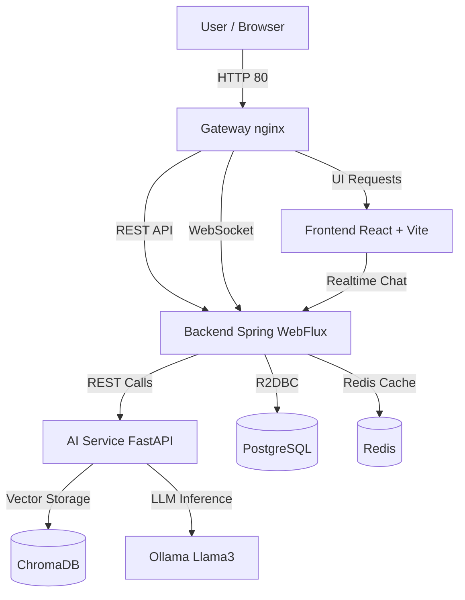
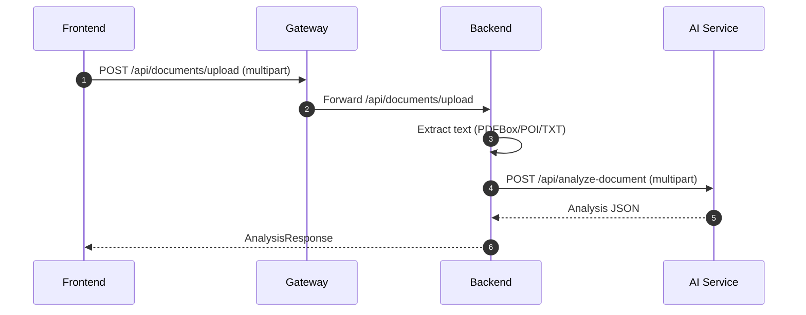
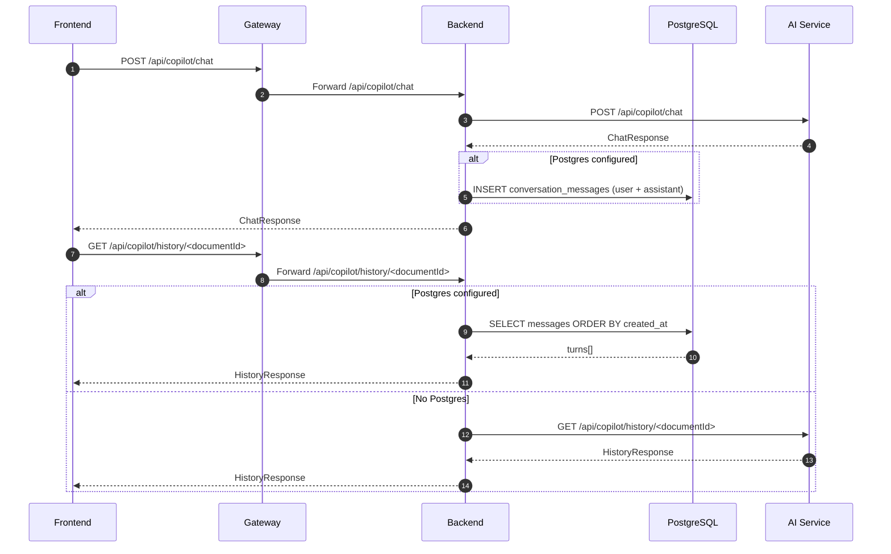
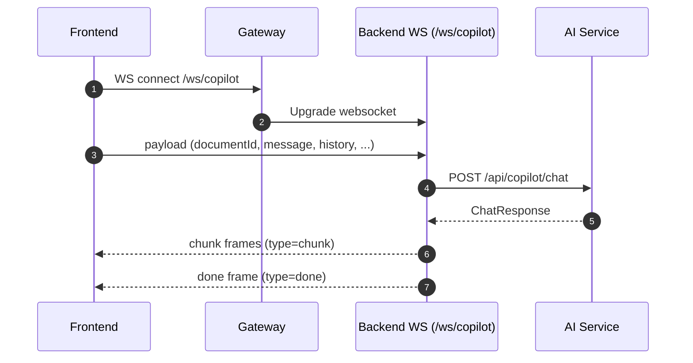
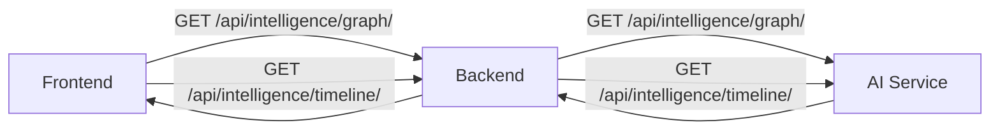

# Legal AI Platform (v2.1)

AI Legal Document Analyser has evolved into a production-ready, local-first **Legal AI Platform** built as a monorepo with a modern edge gateway, a reactive Spring backend, and a FastAPI intelligence service.

It targets first-pass legal review: upload contracts/NDAs, generate structured intelligence, ask Copilot-style questions (REST + WebSocket streaming), and visualize key obligations/dates via graph + timeline.

## Problem Statement

Contract review is high-friction for both legal and non-legal users:

- documents are long, dense, and repetitive
- risks (termination, liability, indemnity, confidentiality, renewal) are spread across many clauses
- deadlines, fees, and obligations are easy to miss
- teams need a fast first-pass triage before escalating to deeper review

## Solution Overview

This platform turns a raw document into **structured, explainable legal intelligence**:

1. **Frontend (React + Vite):** upload, chat, and visualization workspace.
2. **Backend (Spring WebFlux):** file ingestion + extraction + orchestration + WebSocket streaming.
3. **AI service (FastAPI):** analysis and intelligence endpoints.
4. **Postgres + Redis (optional but recommended):** durable history + caching foundations.

## Key Features

- Upload and analyze `PDF`, `DOCX`, `TXT`
- Document comparison (`/api/documents/compare`)
- Simplify selected text (`/api/documents/simplify`)
- Copilot chat over a document (`/api/copilot/chat`)
- WebSocket streaming for Copilot (`/ws/copilot`)
- Graph + timeline views (`/api/intelligence/*`)
- PDF export + text-to-speech for summaries (frontend)
- Local-first stack (Docker Compose) with OSS-first components

## What’s New in v2.1

- **Enterprise monorepo layout:** `apps/`, `packages/`, `infrastructure/`, `docs/`
- **Edge gateway (nginx):** production-style routing (`/` → UI, `/api/*` + `/ws/*` → backend)
- **Frontend upgraded:** React 19 + Vite + feature-driven structure
- **AI runtime upgraded:** Flask → **FastAPI** (compatibility endpoints preserved)
- **Persistence added:** **PostgreSQL (R2DBC + Flyway)** + **Redis** in Docker Compose
- **Chat history persistence:** Copilot chat/history stored in Postgres when configured, with safe fallback
- **Shared API contracts:** `packages/shared-types` (Zod schemas) used by the frontend API client
- **Operational hardening:** request correlation via `X-Request-Id`, health endpoints, health-checked compose startup
- **Docker reliability fixes:** frontend Docker build supports monorepo deps; AI service uses **CPU-only PyTorch** wheels to avoid CUDA bloat

## Quickstart (Docker)

Start the full stack:

```bash
docker compose up -d --build
```

Open:

- **Gateway (recommended):** http://localhost
- **Frontend (direct):** http://localhost:3000
- **Backend (direct):** http://localhost:8080
- **AI service (direct):** http://localhost:5000

Health:

- Backend actuator health: `GET http://localhost:8080/actuator/health`

Stop:

```bash
docker compose down
```

## Architecture

### Runtime Topology



### Core Request Flows

#### 1) Document Upload → Analysis



#### 2) Copilot Chat (REST) + Postgres-backed History (when configured)



#### 3) Copilot Streaming (WebSocket)



### Intelligence Views (Graph + Timeline)



## Repository Structure

```text
.
├── docker-compose.yml
├── .env.example
├── apps/
│   ├── backend/        # Spring Boot 3 WebFlux API + websocket
│   ├── frontend/       # React 19 + Vite UI
│   └── ai-service/     # FastAPI intelligence service
├── packages/
│   └── shared-types/   # Zod schemas shared with the frontend
├── infrastructure/
│   └── nginx/          # Reverse proxy routing (/ /api /ws)
└── docs/
   ├── ARCHITECTURE.md
   └── MIGRATION.md
```

## Key Code Entry Points

Frontend:

- [apps/frontend/src/main.jsx](apps/frontend/src/main.jsx)
- [apps/frontend/src/app/router/router.jsx](apps/frontend/src/app/router/router.jsx)
- [apps/frontend/src/features/dashboard/Dashboard.jsx](apps/frontend/src/features/dashboard/Dashboard.jsx)
- [apps/frontend/src/shared/services/apiClient.js](apps/frontend/src/shared/services/apiClient.js)

Backend:

- [apps/backend/src/main/java/com/legalai/LegalAiApplication.java](apps/backend/src/main/java/com/legalai/LegalAiApplication.java)
- [apps/backend/src/main/java/com/legalai/modules/documents/api/DocumentController.java](apps/backend/src/main/java/com/legalai/modules/documents/api/DocumentController.java)
- [apps/backend/src/main/java/com/legalai/modules/ai/api/CopilotController.java](apps/backend/src/main/java/com/legalai/modules/ai/api/CopilotController.java)
- [apps/backend/src/main/java/com/legalai/infrastructure/websocket/WebSocketConfig.java](apps/backend/src/main/java/com/legalai/infrastructure/websocket/WebSocketConfig.java)

AI service:

- [apps/ai-service/app/main.py](apps/ai-service/app/main.py)
- [apps/ai-service/app/api/routes/legacy.py](apps/ai-service/app/api/routes/legacy.py) (compat routes)
- [apps/ai-service/app/services/intelligence_engine.py](apps/ai-service/app/services/intelligence_engine.py)

## API Surface (Backend)

- `POST /api/documents/upload` (multipart)
- `POST /api/documents/compare` (multipart)
- `POST /api/documents/simplify` (json)
- `POST /api/copilot/chat` (json)
- `GET /api/copilot/history/<documentId>`
- `GET /api/intelligence/graph/<documentId>`
- `GET /api/intelligence/timeline/<documentId>`
- `WS /ws/copilot`

## Configuration

See `.env.example` for the full set.

Common settings:

- `NLP_SERVICE_URL` (backend → AI service)
- `LEGAL_STORAGE_DIR` (backend local storage)
- `OLLAMA_BASE_URL`, `OLLAMA_MODEL` (AI service local model runtime)
- `SPRING_R2DBC_URL`, `SPRING_FLYWAY_*` (Postgres)
- `SPRING_DATA_REDIS_HOST`, `SPRING_DATA_REDIS_PORT` (Redis)

## Tech Stack

- **Frontend:** React 19, Vite, Tailwind, React Query, Zustand, React Hook Form, Zod
- **Backend:** Spring Boot 3 WebFlux, WebSocket streaming, PDFBox, Apache POI, Actuator
- **AI Service:** FastAPI, SpaCy, sentence-transformers, ChromaDB, LangChain, PyMuPDF, Tesseract
- **Data:** PostgreSQL (Flyway migrations + R2DBC), Redis (reactive)
- **Infra:** nginx gateway, Docker Compose

## Developer

- **Name:** Kunal Meena
- **GitHub:** Kunal88591

## Design Principles

- **Structure first:** show risks and highlights before long prose.
- **Explainable output:** keep responses grounded in the document text.
- **Fast first pass:** reduce review time for triage.
- **Local-first:** run the full stack with OSS components.

## Notes

- Backend requires **Java 17** (Spring Boot 3).
- Mermaid diagrams in this README are GitHub-compatible (avoid `{}` in diagram labels).

## Documentation

- [docs/ARCHITECTURE.md](docs/ARCHITECTURE.md)
- [docs/MIGRATION.md](docs/MIGRATION.md)

## Limitations

This is a smart review assistant, not legal advice.

It helps surface risks and obligations faster, but high-stakes decisions should still involve qualified legal review.

## Roadmap (Next)

- Persist document metadata + analysis results in Postgres (not just chat turns)
- Add background job processing for OCR/embedding/indexing
- Add authentication/authorization (JWT-ready) and audit logging
- Harden rate limiting using Redis token-bucket (feature-flagged)
